```mermaid
erDiagram
  %% ==========================================
  %% CORE USER & ORGANIZATION RELATIONSHIPS
  %% ==========================================
  
  USER ||--o{ USER_COMPANY : "member of"
  USER ||--o{ USER_SCHOOL : "member of"
  USER ||--o{ PROJECT : "owns"
  USER ||--o{ PROJECT_MEMBER : "participates in"
  USER ||--o{ USER_BADGE : "receives/sends"
  USER ||--o{ TEAM_MEMBER : "joins teams"
  
  COMPANY ||--o{ USER_COMPANY : "has members"
  COMPANY ||--o{ PROJECT_COMPANY : "hosts projects"
  COMPANY ||--o{ PARTNERSHIP_MEMBER : "participates in"
  COMPANY ||--o{ CONTRACT : "has contracts"
  COMPANY ||--|| COMPANY_TYPE : "belongs to type"
  
  SCHOOL ||--o{ USER_SCHOOL : "has members"
  SCHOOL ||--o{ SCHOOL_LEVEL : "has classes"
  SCHOOL ||--o{ PARTNERSHIP_MEMBER : "participates in"
  SCHOOL ||--o{ CONTRACT : "has contracts"
  
  %% ==========================================
  %% PROJECT RELATIONSHIPS
  %% ==========================================
  
  PROJECT ||--o{ PROJECT_MEMBER : "has participants"
  PROJECT ||--o{ PROJECT_COMPANY : "affiliated with"
  PROJECT ||--o{ PROJECT_SCHOOL_LEVEL : "targets classes"
  PROJECT }o--o| PARTNERSHIP : "belongs to (optional)"
  PROJECT ||--o{ TEAM : "organized in teams"
  PROJECT ||--o{ USER_BADGE : "awards badges"
  PROJECT ||--o{ PROJECT_TAG : "tagged with"
  PROJECT ||--o{ PROJECT_SKILL : "requires skills"
  
  %% ==========================================
  %% PARTNERSHIP SYSTEM
  %% ==========================================
  
  PARTNERSHIP ||--o{ PARTNERSHIP_MEMBER : "has members"
  PARTNERSHIP ||--o{ PROJECT : "contains projects"
  
  %% ==========================================
  %% BADGE SYSTEM
  %% ==========================================
  
  BADGE ||--o{ USER_BADGE : "awarded as"
  BADGE ||--o{ BADGE_SKILL : "requires skills"
  
  SKILL ||--o{ BADGE_SKILL : "required by badges"
  SKILL ||--o{ PROJECT_SKILL : "required by projects"
  SKILL ||--o{ COMPANY_SKILL : "offered by companies"
  SKILL ||--o{ USER_SKILL : "possessed by users"
  
  %% ==========================================
  %% TEAM SYSTEM
  %% ==========================================
  
  TEAM ||--o{ TEAM_MEMBER : "has members"
  
  SCHOOL_LEVEL ||--o{ PROJECT_SCHOOL_LEVEL : "targeted by projects"
  SCHOOL_LEVEL ||--o{ USER_SCHOOL_LEVEL : "attended by users"
  
  TAG ||--o{ PROJECT_TAG : "tags projects"
  
  %% ==========================================
  %% ENTITY DETAILS
  %% ==========================================
  
  USER {
    bigint id PK
    string email UK "unique, required"
    string first_name
    string last_name
    integer role "admin|teacher|tutor|voluntary"
    datetime confirmed_at "email confirmation"
    boolean is_banned "account status"
    string phone_number
    attachment avatar "NEW - Change 2"
  }
  
  COMPANY {
    bigint id PK
    string name "required"
    string city "required"
    string zip_code "required"
    string siret_number UK "14 digits, unique"
    integer status "pending|confirmed"
    bigint company_type_id FK "required"
    text description
    string email
    string website
    attachment logo "NEW - Change 2"
  }
  
  SCHOOL {
    bigint id PK
    string name "required"
    string city "required"
    string zip_code "required"
    integer school_type "primaire|college|lycee|etc"
    integer status "pending|confirmed"
    string referent_phone_number
    attachment logo "NEW - Change 2"
  }
  
  PROJECT {
    bigint id PK
    string title "required"
    text description "required"
    bigint owner_id FK "→ USER, required"
    bigint partnership_id FK "→ PARTNERSHIP, nullable, NEW - Change 7"
    integer status "coming|in_progress|ended"
    date start_date "required"
    date end_date "required"
    boolean private "default: false"
    integer participants_number
    integer time_spent
    attachment main_picture
    attachments pictures
    attachments documents
  }
  
  USER_COMPANY {
    bigint id PK
    bigint user_id FK "required"
    bigint company_id FK "required"
    integer status "pending|confirmed"
    integer role "member|intervenant|referent|admin|superadmin, NEW - Change 3"
  }
  
  USER_SCHOOL {
    bigint id PK
    bigint user_id FK "required"
    bigint school_id FK "required"
    integer status "pending|confirmed"
    integer role "member|intervenant|referent|admin|superadmin, NEW - Change 3"
  }
  
  PROJECT_MEMBER {
    bigint id PK
    bigint user_id FK "required"
    bigint project_id FK "required"
    integer status "pending|confirmed"
    integer role "member|admin|co_owner, NEW - Change 6"
  }
  
  PARTNERSHIP {
    bigint id PK
    string initiator_type "Company|School, polymorphic"
    bigint initiator_id FK "polymorphic"
    integer status "pending|confirmed|rejected"
    integer partnership_type "bilateral|multilateral"
    boolean share_members "default: false"
    boolean share_projects "default: true"
    boolean has_sponsorship "default: false"
    string name "required for multilateral"
    text description
    datetime confirmed_at
  }
  
  PARTNERSHIP_MEMBER {
    bigint id PK
    bigint partnership_id FK "required"
    string participant_type "Company|School, polymorphic"
    bigint participant_id FK "polymorphic"
    integer member_status "pending|confirmed|declined"
    integer role_in_partnership "partner|sponsor|beneficiary"
    datetime joined_at
    datetime confirmed_at
  }
  
  BADGE {
    bigint id PK
    string name "required"
    text description "required"
    integer level "1|2|3|4, required"
    string series "default: Série TouKouLeur, NEW - Change 1"
    attachment icon "required"
  }
  
  USER_BADGE {
    bigint id PK
    bigint sender_id FK "→ USER, who gave the badge"
    bigint receiver_id FK "→ USER, who received it"
    bigint badge_id FK "required"
    bigint project_id FK "optional, badge context"
    string organization_type "Company|School, polymorphic"
    bigint organization_id FK "polymorphic"
    integer status "pending|approved|rejected"
    integer level "1|2|3|4"
    text comment
    attachments documents "required for level 2+"
  }
  
  CONTRACT {
    bigint id PK
    bigint school_id FK "nullable, XOR with company_id"
    bigint company_id FK "nullable, XOR with school_id"
    boolean active "only one active per org"
    date start_date "required"
    date end_date "required"
  }
  
  SCHOOL_LEVEL {
    bigint id PK
    string name "A|B|1|2|etc"
    bigint school_id FK "required"
    integer level "enum, validated by school_type"
  }
  
  TEAM {
    bigint id PK
    string name "required"
    bigint project_id FK "required"
  }
  
  PROJECT_COMPANY {
    bigint id PK
    bigint project_id FK
    bigint company_id FK
  }
  
  PROJECT_SCHOOL_LEVEL {
    bigint id PK
    bigint project_id FK
    bigint school_level_id FK
  }
  
  TEAM_MEMBER {
    bigint id PK
    bigint user_id FK
    bigint team_id FK
  }
  
  SKILL {
    bigint id PK
    string name
  }
  
  TAG {
    bigint id PK
    string name
  }
  
  COMPANY_TYPE {
    bigint id PK
    string name "Entreprise|Association|Collectivité"
  }
```

# Kinship Database Schema - Entity Relationship Diagram

## How to View This Diagram

Paste the code below into:
- **Mermaid Live Editor**: https://mermaid.live
- **GitHub/GitLab**: Will render automatically in markdown
- **VS Code**: With Mermaid extension
- **Notion, Obsidian, etc.**

---

---

## Key Relationships Summary

### **User Membership**
- Users can be members of multiple companies (USER_COMPANY)
- Users can be members of multiple schools (USER_SCHOOL)
- Each membership has a role: member → intervenant → referent → admin → superadmin

### **Project Ownership & Participation**
- Projects have ONE owner (User)
- Projects can have multiple participants (PROJECT_MEMBER) with roles
- Projects can optionally belong to a PARTNERSHIP
- Projects are affiliated with companies and target school levels

### **Partnership System**
- Partnerships have polymorphic members (Company or School)
- Partnerships can contain multiple projects
- Members have status (pending/confirmed) and roles (partner/sponsor/beneficiary)

### **Badge System**
- Badges belong to series (e.g., "Série TouKouLeur")
- User badges are given by one user to another
- User badges are associated with projects and organizations
- Different levels (1-4) with different approval requirements

### **Hierarchies**
- Schools → School Levels (classes)
- Projects → Teams → Team Members
- Skills → Sub-Skills
- Companies → Company Types

---

## New Features from Our Changes

- **Change #1**: Badge.series (badge collections)
- **Change #2**: User.avatar, Company.logo, School.logo
- **Change #3**: USER_COMPANY.role, USER_SCHOOL.role (enum hierarchy)
- **Change #5**: PARTNERSHIP & PARTNERSHIP_MEMBER (multi-party system)
- **Change #6**: PROJECT_MEMBER.role (co-owner support)
- **Change #7**: PROJECT.partnership_id (partner projects)

---

## Total Tables: 47

Core: 13 tables (User, Company, School, Project, Badge, etc.)
Join Tables: 18 tables (USER_COMPANY, PROJECT_MEMBER, etc.)
Supporting: 16 tables (Tags, Skills, Contracts, etc.)
